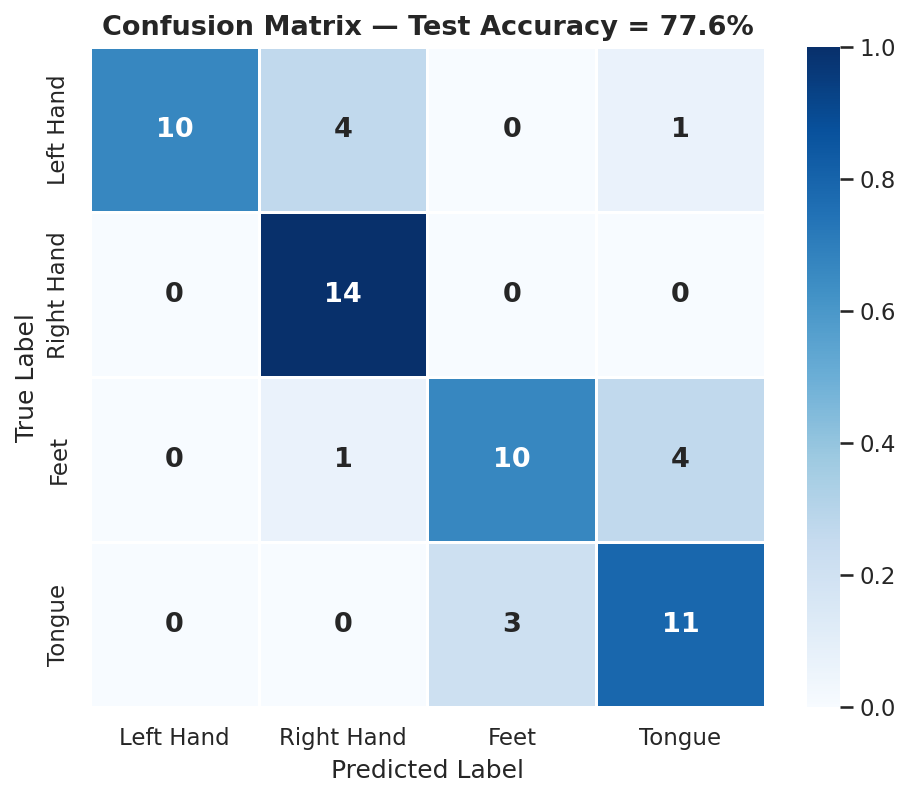
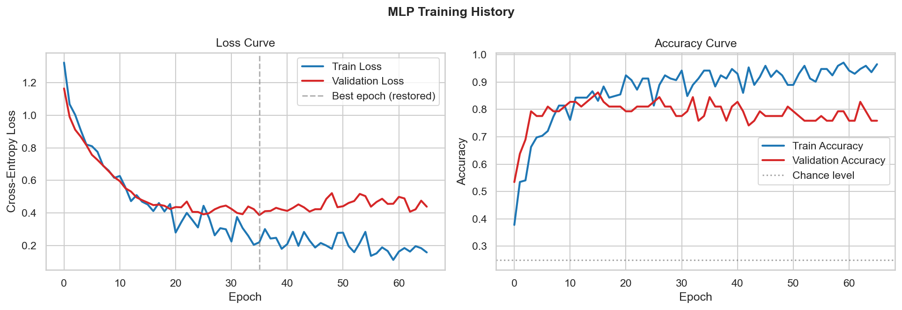
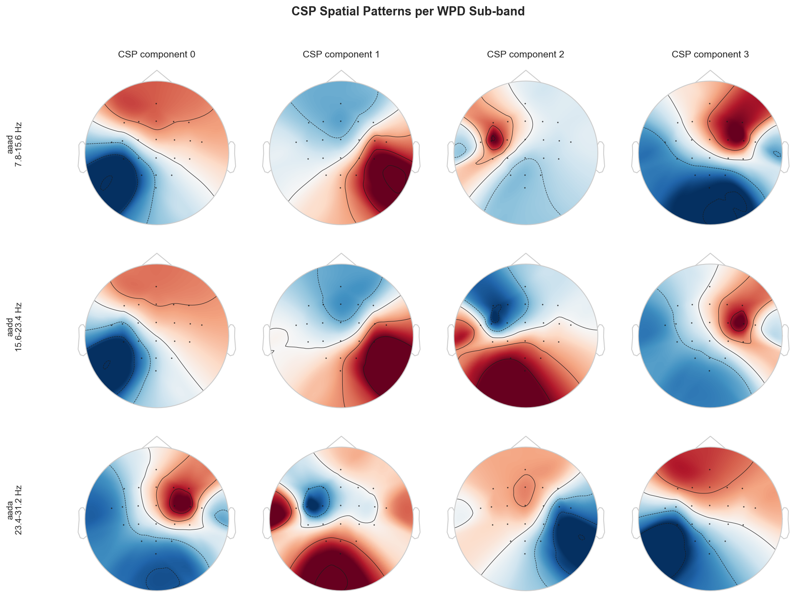
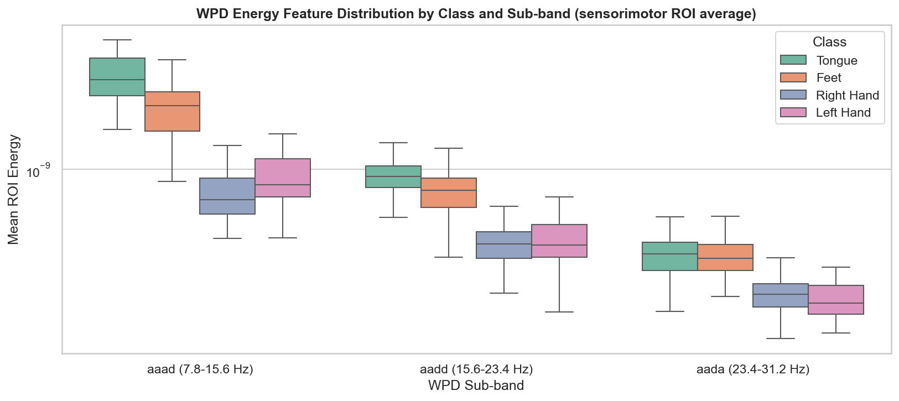

# Hybrid EEG Motor Imagery Classifier: WPD + CSP + MLP

[](#)
[](#)
[](#)
[](#)
[](#)

A hybrid EEG motor imagery classification pipeline that combines Wavelet Packet Decomposition, Filter-Bank Common Spatial Patterns, and a PyTorch MLP.  

## 📌 Overview


Motor imagery BCIs classify which movement a person is *imagining* purely from
their EEG, with no actual movement involved — a hard, noisy, low-SNR problem. This
project builds a classical-but-rigorous signal-processing pipeline that fuses
**Wavelet Packet Decomposition (WPD)**, **Filter-Bank Common Spatial Patterns
(CSP)**, and a **PyTorch MLP** to classify **4 classes of motor imagery** — left
hand, right hand, feet, and tongue — achieving strong accuracy without requiring
GPU-hungry deep learning.

| Task | Dataset | Test Accuracy | Macro F1 |
|---|---|---|---|
| 4-class MI (Left/Right/Feet/Tongue) | BCI IV-2a, A01T (22 EEG + 3 EOG, 250 Hz) | **77.6%** (chance = 25%) | **0.77** |

> 💡 **Note:** WPD and CSP are not treated as competing choices here — WPD acts as
> a data-driven filter bank, and a separate CSP spatial filter is fit **per
> WPD sub-band** (a wavelet-packet variant of the well-established
> **Filter-Bank CSP** algorithm, Ang et al., 2008), then fused with WPD
> statistical features before classification. Full rationale is in the notebook.

---

## 📊 Dataset

This project uses **subject A01T** from the
[**BCI Competition IV, Dataset 2a**](https://www.bbci.de/competition/iv/#dataset2a)
(Brunner et al., 2008):
| Channels | Sampling Rate | Classes | Trials | Paradigm |
|---|---|---|---|---|
| 22 EEG + 3 EOG | **250 Hz** | Left hand, right hand, feet, tongue | **288** (72 per class, balanced) | Cue-based; imagery cued at *t* = 2 s, performed until *t* = 6 s |

> 💡 **Note:** `A01T.gdf` (33 MB) is **not included** in this repository — download
> it from the link above and place it in the project root before running the
> notebook.

---

## ⚙️ Pipeline

1. **Preprocessing** *(MNE-Python)* — ICA-based EOG artifact removal → 8-30 Hz
   band-pass (mu + beta rhythms) → cue-aligned epoching `[-0.5, 4.0] s` with
   baseline correction, cropped to a `[0.5, 3.5] s` steady-state imagery window.
2. **Wavelet Packet Decomposition** *(PyWavelets)* — `db4` wavelet, depth 4,
   auto-selects the 3 sub-bands overlapping 8-30 Hz → Energy, Variance, and
   Shannon Entropy features per channel per sub-band.
3. **Filter-Bank CSP** *(mne.decoding.CSP)* — 4-component CSP fit independently
   on each WPD sub-band, **strictly on the training split** to avoid data
   leakage → log-variance features concatenated with WPD statistics.
4. **MLP Classifier** *(PyTorch)* — `57 → 128 → 64 → 4` with BatchNorm, Dropout
   (0.5 / 0.3), Adam + weight decay, and early stopping on validation loss.

---

## 📈 Results
 
The model reaches **77.6% accuracy** on the held-out test set, more than 3x the
25% chance level for 4 balanced classes. **Right Hand** is recognized perfectly
(100% recall), while **Feet** and **Tongue** show the most confusion with each
other — expected, since both involve lower-limb/orofacial motor cortex regions
that sit closer together on the scalp than the hand areas do.
 
<p align="center">
  <br>
  <sub><b>Confusion Matrix.</b> Test-set predictions vs. true labels — 77.6% overall accuracy across 4 balanced classes.</sub>
</p>

<br>


<p align="center">
  <br>
  <sub><b>Training History.</b> Train vs. validation loss and accuracy; early stopping (patience = 30 epochs) restores the lowest-validation-loss checkpoint.</sub>
</p>

<br>

<p align="center">
  <br>
  <sub><b>CSP Spatial Patterns.</b> Top-4 CSP components per WPD sub-band (rows: mu, low-beta, high-beta). Discriminative activity concentrates over central sensorimotor electrodes, consistent with motor-imagery neuroscience.</sub>
</p>

<br>

<p align="center">
  <br>
  <sub><b>WPD Energy Features.</b> Mean wavelet-packet energy at the sensorimotor ROI (C3, C1, Cz, C2, C4) by sub-band and class — visible separation confirms these hand-crafted features carry discriminative signal.</sub>
</p>

> 💡 Note: These results were obtained exclusively on the BCI Competition IV-2a A01T recording and may not generalize to other subjects, sessions, or datasets.

---

## 🚀 Installation & Usage

### 1. Clone the repository
```bash
git clone https://github.com/alitkbbl/Hybrid-EEG-Classifier-WPD-CSP
cd Hybrid-EEG-Classifier-WPD-CSP
```

### 2. Install dependencies
```bash
pip install -r requirements.txt
```

Download A01T.gdf from the BCI Competition IV-2a page (see Dataset section)

### 3. Launch Jupyter and run all cells top to bottom
```bash
jupyter notebook Hybrid-EEG-Classifier-WPD-CSP.ipynb
```

---

### 🔗 References

- Ang, K. K., Chin, Z. Y., Zhang, H., & Guan, C. (2008). *Filter Bank Common
  Spatial Pattern (FBCSP) in Brain-Computer Interface.* IEEE IJCNN.
- Brunner, C. et al. (2008). *BCI Competition 2008 – Graz data set A.*
- Ramoser, H., Muller-Gerking, J., & Pfurtscheller, G. (2000). *Optimal spatial
  filtering of single trial EEG during imagined hand movement.* IEEE Trans.
  Rehabilitation Engineering.
